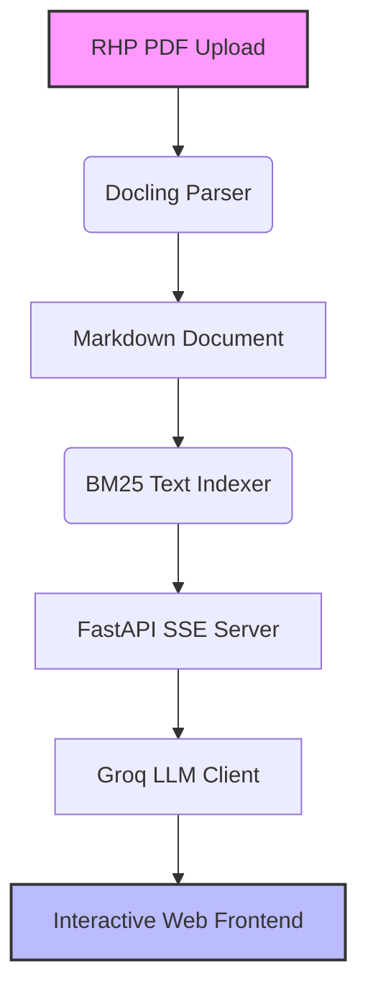

# ⚡ IPO Lens — AI-Powered RHP Analyzer

An interactive web application designed to analyze Indian IPO Red Herring Prospectuses (RHPs) using advanced RAG (Retrieval-Augmented Generation) and LLMs. The tool extracts and evaluates key financial sections, and streams a structured analysis of the business viability, risk factors, and valuation, ending with a synthesized investment verdict.

---

## 🚀 Key Features

*   **Docling PDF Parsing:** High-fidelity conversion of complex, large IPO PDF documents into clean, structured Markdown.
*   **Zero-Dependency BM25 RAG:** Fast, lightweight keyword-based retrieval tuned for dense financial text. No heavy vector database downloads or GPU dependencies.
*   **Sequential Multi-Section Analysis:** Systematically analyzes 7 crucial RHP sections:
    1.  🎯 **Objects of the Issue** — fresh issues vs. OFS (Offer for Sale) and fund utilization.
    2.  📊 **Financial Metrics** — revenue trends, EBITDA margins, PAT growth, and key ratios.
    3.  ⚠️ **Key Risk Factors** — internal, external, and legal liabilities.
    4.  🏢 **Industry & Market Position** — peer group comparison, industry CAGR, competitive edge.
    5.  👔 **Management & Governance** — promoter history, remuneration, and executive profile.
    6.  ⚖️ **Legal & Regulatory Actions** — material litigations, tax demands, promoter cases.
    7.  🏷️ **Valuation & Pricing** — P/E multiples, EPS, book value comparison vs. peers.
*   **Real-time Streaming (SSE):** Watch the AI agent process, retrieve, and generate section-by-section analysis in real-time.
*   **Synthesized Investment Verdict:** Evaluates positive signals, red flags, and outputs a concise investment rationale with risk-adjusted recommendations.

---

## 🛠️ Architecture & Tech Stack



*   **Backend:** [FastAPI](https://fastapi.tiangolo.com/) (Python)
*   **LLM Provider:** [Groq Cloud API](https://console.groq.com/) (using fast inference engines)
*   **PDF Extraction:** [Docling](https://github.com/DS4SD/docling) by IBM
*   **Information Retrieval:** BM25 (Rank-BM25)
*   **Frontend:** Vanilla HTML5, CSS3 (Modern premium dark mode, glassmorphism), and Javascript (Server-Sent Events connection)

---

## 📥 Setup & Installation

### Prerequisites

*   Python 3.10 or newer installed on your machine.
*   A Groq API Key. You can get one from the [Groq Console](https://console.groq.com/).

### Installation Steps

1.  **Clone the Repository:**
    ```bash
    git clone https://github.com/shivam7861/IPO-Analyzer.git
    cd IPO-Analyzer
    ```

2.  **Create and Activate a Virtual Environment:**
    ```bash
    python3 -m venv ipo_venv
    source ipo_venv/bin/activate
    ```

3.  **Install Dependencies:**
    ```bash
    pip install --upgrade pip
    pip install -r requirements.txt
    ```

4.  **Configure Environment Variables:**
    Create a `.env` file in the root directory and add your Groq API key:
    ```env
    GROQ_API_KEY=your_groq_api_key_here
    ```

---

## ⚙️ How to Run

Launch the local development server using the helper script:

```bash
chmod +x run.sh
./run.sh
```

Alternatively, run Uvicorn directly:

```bash
uvicorn app.main:app --host 0.0.0.0 --port 8000 --reload
```

Once running, navigate to **`http://localhost:8000`** in your browser.

---

## 💡 Usage Workflow

1.  Enter your **Groq API Key** in the frontend input field (or leave it blank if you configured `GROQ_API_KEY` in your `.env` file).
2.  Upload an IPO Red Herring Prospectus (RHP) PDF.
3.  Click **"Analyze IPO"**.
4.  Observe the parsing, chunking, and retrieval pipeline statuses.
5.  Watch the sequential analysis stream in real-time.
6.  Read the final synthesized **Investment Verdict** before deciding.

---

## ⚠️ Disclaimer

This application is for educational and research purposes only. It is not financial or investment advice. Always consult a certified financial advisor before making any real-world investment decisions.
